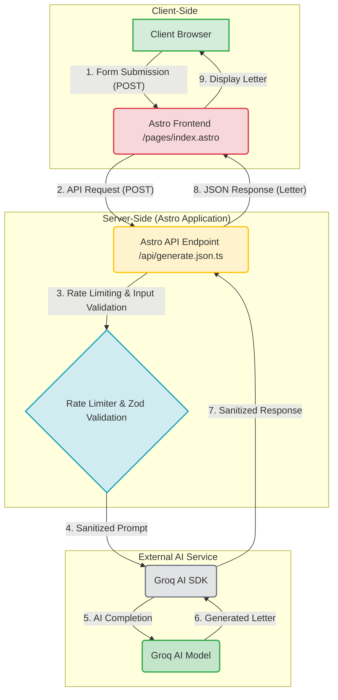

# 💖 Valentines AI Love Letter Generator

[](https://github.com/your-username/your-repo/actions)
[](./LICENSE)
[](https://astro.build/)
[](https://vercel.com/)
[](https://pages.cloudflare.com/)
[](https://biomejs.dev/)

**_Craft heartfelt love letters instantly with AI magic._**

---

## 📝 Table of Contents

*   [🌟 Overview / Introduction](#-overview--introduction)
*   [✨ Feature Highlights](#-feature-highlights)
*   [🏗️ Architecture / Design / Modules](#%EF%B8%8F-architecture--design--modules)
*   [🚀 Getting Started / Installation / Setup](#-getting-started--installation--setup)
    *   [Prerequisites](#prerequisites)
    *   [Installation Steps](#installation-steps)
    *   [Configuration](#configuration)
    *   [Running the Application](#running-the-application)
*   [💖 Usage / Workflows / Examples](#-usage--workflows--examples)
*   [💡 Interactivity & Navigation Enhancements](#-interactivity--navigation-enhancements)
*   [🚧 Limitations, Known Issues & Future Roadmap](#-limitations-known-issues--future-roadmap)
*   [🤝 Contributing & Development Guidelines](#-contributing--development-guidelines)
*   [📄 License, Credits & Contact](#-license-credits--contact)
*   [📚 Appendix / Optional Extras](#-appendix--optional-extras)
    *   [Changelog](#changelog)
    *   [FAQ](#faq)
    *   [API Reference](#api-reference)

---

## 🌟 Overview / Introduction

The **Valentines AI Love Letter Generator** is a delightful web application designed to help you express your deepest affections with ease. Whether you're struggling with writer's block, short on time, or simply want a unique way to convey your feelings, this tool leverages the power of Artificial Intelligence to craft personalized love letters.

Its purpose is to empower users to generate heartfelt messages tailored to their specific relationship, desired tone, and personal details. It solves the common problem of finding the right words, allowing you to create beautiful, romantic, playful, or poetic letters in moments, making special occasions (or any day!) even more memorable.

[Back to top](#%EF%B8%8F-table-of-contents)

## ✨ Feature Highlights

*   **AI-Powered Letter Generation:** Utilizes the Groq AI model to generate unique and expressive love letters based on user input.
*   **Customizable Input:** Tailor letters by specifying the recipient's name, relationship type (partner, crush, spouse), and desired tone (romantic, playful, poetic).
*   **Special Details Inclusion:** Add specific memories or details to make the letter truly personal.
*   **Robust Input Sanitization:** Automatically cleans and sanitizes user inputs to prevent malicious injections and ensure content quality.
*   **API Rate Limiting:** Protects the backend API from abuse by limiting the number of requests per user within a specified time window.
*   **Responsive User Interface:** A beautiful, themed, and mobile-friendly interface built with Astro, React, and TailwindCSS.
*   **Copy-to-Clipboard Functionality:** Easily copy the generated letter to your clipboard with a single click.
*   **Server-Side Rendering (SSR):** Leverages Astro's SSR capabilities for enhanced performance and SEO.
*   **Flexible Deployment:** Configured for deployment on both Vercel and Cloudflare Pages.

[Back to top](#%EF%B8%8F-table-of-contents)

## 🏗️ Architecture / Design / Modules

The Valentines AI Love Letter Generator follows a client-server architecture, with Astro serving as the framework for both the frontend and the API endpoint.

<details>
<summary><b>High-Level System Diagram (Click to expand)</b></summary>


</details>

### Key Modules and Responsibilities:

*   **`src/pages/index.astro` (Frontend):**
    *   Renders the main user interface, including the love letter generation form and the display area for the generated letter.
    *   Handles client-side form submission.
    *   Communicates with the `/api/generate.json` endpoint to request letter generation.
    *   Manages loading states and displays error messages.
    *   Includes inline JavaScript for form handling and the copy-to-clipboard feature.
*   **`src/pages/api/generate.json.ts` (Backend API Endpoint):**
    *   Receives `POST` requests from the frontend containing user input.
    *   Applies **rate limiting** using the `withRateLimit` middleware to prevent abuse.
    *   Performs server-side input validation using `zod` based on `RequestSchema`.
    *   Sanitizes both the incoming user input and the outgoing AI-generated content.
    *   Constructs a prompt for the Groq AI model, incorporating a `safetyPrompt` for responsible AI use.
    *   Interacts with the `groq-sdk` to send the prompt and receive the AI-generated letter.
    *   Returns the generated letter as a JSON response or an error message.
*   **`src/lib/rate-limiter.ts` (Rate Limiting Utility):**
    *   Provides a `RateLimiter` class to track request counts per IP address within a configurable time window.
    *   `withRateLimit` is an Astro API route middleware that enforces rate limits and returns a `429 Too Many Requests` status if exceeded.
*   **`src/lib/sanitize.ts` (Sanitization Utility):**
    *   Offers `sanitizeInput` and `sanitizePrompt` functions to clean user-provided text and AI prompts, removing potentially harmful or unwanted content (e.g., HTML tags, special characters, prompt injections).
*   **`src/store.ts` (State Management):**
    *   Uses `nanostores` for simple, lightweight global state management (though currently, state is largely managed locally within `index.astro`'s script). This can be expanded for more complex global states.
*   **`astro.config.mjs` (Astro Configuration):**
    *   Configures Astro for `output: 'server'`, enabling server-side rendering.
    *   Integrates the `@astrojs/vercel` adapter, allowing deployment as a Vercel serverless function.
    *   Includes `vite` SSR configuration to prevent externalizing certain dependencies.
*   **`package.json` (Project Dependencies & Scripts):**
    *   Lists all project dependencies, including `astro`, `react`, `groq-sdk`, `zod`, `tailwindcss`, `nanostores`, and various Astro adapters.
    *   Defines scripts for development (`dev`), building (`build`), local preview (`preview`), and Cloudflare Pages deployment (`deploy`).
*   **`biome.json` (Code Quality Configuration):**
    *   Configures the Biome linter and formatter, ensuring consistent code style and identifying potential issues.

[Back to top](#%EF%B8%8F-table-of-contents)

## 🚀 Getting Started / Installation / Setup

Follow these steps to get the Valentines AI Love Letter Generator up and running on your local machine.

### Prerequisites

Before you begin, ensure you have the following installed:

*   **Node.js**: Version 18.0 or higher.
*   **npm** (Node Package Manager) or **yarn** / **pnpm** / **bun**: Used for package management.
*   **Groq API Key**: You'll need an API key from [Groq](https://groq.com/) to interact with their AI models.

### Installation Steps

1.  **Clone the repository:**

    ```bash
    git clone https://github.com/WomB0ComB0/valentines.git
    cd valentines
    ```

2.  **Install dependencies:**

    ```bash
    npm install
    # or pnpm install
    # or yarn install
    # or bun install
    ```

### Configuration

1.  **Environment Variables:**
    Create a `.env` file in the root of your project. This file will store your sensitive API keys.

    ```dotenv
    # .env
    GROQ_API_KEY="your_groq_api_key_here"
    ```
    **⚠️ Important:** Replace `"your_groq_api_key_here"` with your actual API key obtained from [Groq](https://groq.com/). Do not commit your `.env` file to version control.

### Running the Application

1.  **Development Mode:**
    To start the local development server:

    ```bash
    npm run dev
    ```
    The application will be accessible at `http://localhost:4321`.

2.  **Build for Production:**
    To build the application for production:

    ```bash
    npm run build
    ```
    This will compile your Astro project into the `./dist/` directory.

3.  **Preview Production Build Locally:**
    To preview your production build before deploying:

    ```bash
    npm run preview
    ```
    This command will start a local server to serve the built application.

4.  **Deployment (Cloudflare Pages):**
    This project is configured for deployment to Cloudflare Pages using Wrangler. Ensure you have Cloudflare Pages CLI (`wrangler`) installed and configured.

    ```bash
    npm run deploy
    ```
    This script first builds the Astro project and then deploys it via Wrangler.

[Back to top](#%EF%B8%8F-table-of-contents)

## 💖 Usage / Workflows / Examples

Using the Valentines AI Love Letter Generator is straightforward and designed for a smooth user experience.

### Step-by-Step Workflow

1.  **Access the Application:** Open your web browser and navigate to the application's URL (e.g., `http://localhost:4321` in development or your deployed URL).

2.  **Fill Out the Form:**
    *   **Recipient's Name:** Enter the name of the person you're writing the letter to.
    *   **Your Relationship:** Select the nature of your relationship from the dropdown (Partner, Crush, Spouse).
    *   **Tone:** Choose the desired tone for your letter (Romantic, Playful, Poetic).
    *   **Special Details (Optional):** Add any specific memories, inside jokes, or details you want the AI to incorporate into the letter. This helps personalize the output.

3.  **Generate the Letter:** Click the "Generate Love Letter" button. The application will show a "Generating..." message while the AI processes your request.

4.  **View and Copy Your Letter:**
    *   Once generated, your personalized love letter will appear in the "Your Love Letter" section.
    *   You can review the letter.
    *   Click the "Copy" button (📋 icon) to quickly copy the entire letter to your clipboard, ready to be pasted into an email, message, or card.

### Example Scenario

Imagine you want to write a romantic letter to your spouse, Sarah, and remind her of your anniversary trip to Paris.

1.  You would input:
    *   **Recipient's Name:** `Sarah`
    *   **Your Relationship:** `Spouse`
    *   **Tone:** `Romantic`
    *   **Special Details:** `Our unforgettable anniversary trip to Paris.`

2.  Clicking "Generate Love Letter" might produce something like:
    ```
    My Dearest Sarah,

    As I sit to write to you, my heart overflows with the love that has grown deeper with each passing moment we've shared. You are not just my spouse; you are the very essence of my joy, my confidante, and my greatest adventure.

    I often find myself reminiscing about our unforgettable anniversary trip to Paris, the city of lights. Every cobbled street, every shared croissant, every stolen glance beneath the Eiffel Tower etched itself into the canvas of my soul. Those moments, bathed in the soft glow of Parisian evenings, are treasures I hold dear, testaments to the beautiful life we are building together.

    Your laughter is my favorite melody, your touch a comforting embrace I never want to leave. With you, every day is a celebration of love, a journey filled with warmth and understanding. You inspire me, challenge me, and make me a better person simply by being you.

    Thank you, my love, for every memory, every dream, and every beat of my heart that belongs to you. Here's to countless more anniversaries, countless more cities, and a lifetime filled with the profound and unwavering love we share.

    Forever yours,
    [Your Name]
    ```

[Back to top](#%EF%B8%8F-table-of-contents)

## 💡 Interactivity & Navigation Enhancements

This documentation itself is enhanced for better readability and navigation:

*   **Collapsible Sections:** Key information, such as the architecture diagram, is hidden within `<details>` tags, allowing you to expand only what you need.
*   **Internal Links and Anchors:** The "Table of Contents" provides quick jumps to any section, and "Back to top" links are included to easily return to the navigation.
*   **Embedded Diagrams:** The "Architecture / Design / Modules" section includes a Mermaid diagram to visually explain the system flow, generated directly from text for easy maintenance.
*   **Dynamic UI Elements:** The application itself features dynamic updates:
    *   The "Generate Love Letter" button changes text and disables during AI processing.
    *   Error messages appear and disappear based on validation or API issues.
    *   The generated letter section becomes visible only after a successful generation.
    *   The "Copy" button provides instant visual feedback when the text is copied to the clipboard.

[Back to top](#%EF%B8%8F-table-of-contents)

## 🚧 Limitations, Known Issues & Future Roadmap

### Limitations

*   **AI Genericity:** While customizable, the AI might occasionally produce somewhat generic responses if very specific details are not provided or if the prompt is too broad.
*   **Context Window:** The AI model has a limited context window, which might restrict the depth or complexity of details it can incorporate effectively.
*   **Rate Limits:** The API enforces rate limiting (default: 50 requests per minute) to ensure fair usage and protect resources. Exceeding this will result in a `429 Too Many Requests` error.
*   **Safety Filters:** The AI model and the implemented `safetyPrompt` aim to prevent inappropriate content. However, no filter is foolproof, and users should exercise discretion.

### Known Issues

*   **Vercel `403 Forbidden` (Potential):** During development or specific deployment configurations, a `403 Forbidden` error with `x-vercel-challenge-token` or `x-vercel-mitigated: challenge` might occur. This usually indicates Vercel's security measures, often due to automated requests or incorrect environment configurations. Ensure your Vercel deployment has correctly configured environment variables (like `GROQ_API_KEY`) and that requests from the frontend are properly authenticated or handled by Vercel's edge functions.

### Future Roadmap

*   **Expanded Customization Options:**
    *   Allow users to specify mood, length, or specific keywords to include/exclude.
    *   Support for multiple languages.
*   **Multiple AI Model Support:** Integrate with other LLM providers (e.g., OpenAI, Anthropic) to offer diverse generation styles.
*   **User Accounts & Saving:** Implement user authentication and allow users to save their generated letters.
*   **Sharing Functionality:** Enable easy sharing of letters via social media or email.
*   **Pre-built Templates:** Offer a selection of pre-designed letter templates for quick use.
*   **Image Generation (Optional):** Explore integrating image generation for personalized letter backgrounds or accompanying visuals.
*   **Refined UI/UX:** Continuous improvements to the user interface and overall experience.

[Back to top](#%EF%B8%8F-table-of-contents)

## 🤝 Contributing & Development Guidelines

We welcome contributions to improve the Valentines AI Love Letter Generator!

### How to Contribute

1.  **Fork the repository:** Start by forking the project to your GitHub account.
2.  **Clone your fork:**
    ```bash
    git clone https://github.com/WomB0ComB0/valentines.git
    cd valentines
    ```
3.  **Create a new branch:**
    ```bash
    git checkout -b feature/your-feature-name
    ```
    Choose a descriptive name for your branch (e.g., `feature/add-dark-mode`, `fix/api-error-handling`).
4.  **Make your changes:** Implement your feature or fix.
5.  **Run Biome for linting and formatting:**
    This project uses Biome for code quality. Ensure your code adheres to the project's standards.
    ```bash
    npx @biomejs/biome check --apply src
    ```
6.  **Commit your changes:**
    ```bash
    git commit -m "feat: Add your descriptive commit message"
    ```
    Follow conventional commit guidelines if possible.
7.  **Push to your fork:**
    ```bash
    git push origin feature/your-feature-name
    ```
8.  **Open a Pull Request (PR):**
    Go to the original repository on GitHub and open a pull request from your fork's branch to the `main` branch. Provide a clear description of your changes.

### Code Style, Testing, and Linting

*   **Code Style:** We follow the code style enforced by `biome.json`. Please ensure your code passes Biome checks before submitting a PR.
*   **Linting:** Run `npm run lint` (if defined, otherwise `npx @biomejs/biome check`) to catch and fix potential code issues.
*   **Testing:** While no explicit testing framework is currently configured, contributions that include tests for new features or bug fixes are highly encouraged.

[Back to top](#%EF%B8%8F-table-of-contents)

## 📄 License, Credits & Contact

### License

This project is licensed under the **MIT License**. See the [LICENSE](./LICENSE) file for details.

### Acknowledgments

This project relies on the amazing work of many open-source projects and communities:

*   [**Astro**](https://astro.build/): The web framework for building fast, content-driven websites.
*   [**Groq**](https://groq.com/): For providing fast inference AI models.
*   [**React**](https://react.dev/): For building interactive UI components within Astro.
*   [**Tailwind CSS**](https://tailwindcss.com/): For utility-first CSS styling.
*   [**Zod**](https://zod.dev/): For robust schema validation.
*   [**Biome**](https://biomejs.dev/): For blazing-fast code linting and formatting.
*   [**Nanostores**](https://nanostores.github.io/): For tiny and fast state management.
*   [**Vercel**](https://vercel.com/): For seamless deployment and hosting.
*   [**Cloudflare Pages**](https://pages.cloudflare.com/): For fast global deployment and edge functions.
*   [**Lucide React**](https://lucide.dev/): For beautiful and customizable SVG icons.

### Contact

For any questions, suggestions, or collaborations, please open an issue on the [GitHub repository](https://github.com/WomB0ComB0/valentines/issues).

[Back to top](#%EF%B8%8F-table-of-contents)

## 📚 Appendix / Optional Extras

### Changelog

**v0.1.0 - September 25, 2025**

*   Initial release of the Valentines AI Love Letter Generator.
*   Core AI letter generation functionality implemented.
*   Basic UI with form input and letter display.
*   Rate limiting and input sanitization added.
*   Configured for Vercel and Cloudflare Pages deployment.

### FAQ

<details>
<summary><b>Q: Is my Groq API key safe?</b></summary>
<br>
<b>A:</b> Yes, your Groq API key should be stored in a `.env` file and is only used on the server-side to communicate with the Groq API. It is not exposed to the client-side. Make sure you never commit your `.env` file to your repository.
</details>

<details>
<summary><b>Q: What AI model is being used?</b></summary>
<br>
<b>A:</b> The application currently uses the `meta-llama/llama-4-scout-17b-16e-instruct` model via the Groq SDK. This can be easily configured in `src/pages/api/generate.json.ts`.
</details>

<details>
<summary><b>Q: Can I deploy this project to other platforms?</b></summary>
<br>
<b>A:</b> Yes, Astro supports various deployment adapters. While currently configured for Vercel and Cloudflare Pages, you can explore other adapters like `@astrojs/node` or `@astrojs/netlify` by modifying `astro.config.mjs` and `package.json` scripts.
</details>

### API Reference

#### `POST /api/generate.json`

This endpoint is responsible for generating the love letter.

*   **Method:** `POST`
*   **Content-Type:** `application/json`

**Request Body:**

| Field          | Type     | Required | Description                                             | Constraints                          |
| :------------- | :------- | :------- | :------------------------------------------------------ | :----------------------------------- |
| `recipient`    | `string` | Yes      | The name of the recipient.                              | Min 1, Max 50 characters, sanitized. |
| `relationship` | `enum`   | Yes      | The user's relationship to the recipient.               | `partner`, `crush`, `spouse`         |
| `tone`         | `enum`   | Yes      | The desired tone of the letter.                         | `romantic`, `playful`, `poetic`      |
| `details`      | `string` | No       | Any specific details or memories to include.            | Max 500 characters, sanitized.       |

**Example Request:**

```json
{
  "recipient": "Alex",
  "relationship": "partner",
  "tone": "romantic",
  "details": "Our first date was at the coffee shop downtown, and we laughed for hours."
}
```

**Successful Response (200 OK):**

```json
{
  "letter": "My Dearest Alex, Your laughter at that downtown coffee shop, during our very first date, still echoes sweetly in my memories..."
}
```

**Error Responses:**

*   **400 Bad Request:**
    ```json
    {
      "error": "Recipient name is required"
    }
    ```
    (Or other validation errors from Zod)
*   **429 Too Many Requests:**
    ```json
    {
      "error": "Too many requests. Please try again later."
    }
    ```
    (Rate limit exceeded)
*   **500 Internal Server Error:**
    ```json
    {
      "error": "An unexpected error occurred"
    }
    ```
    (Server-side issues or Groq API errors)

[Back to top](#%EF%B8%8F-table-of-contents)
